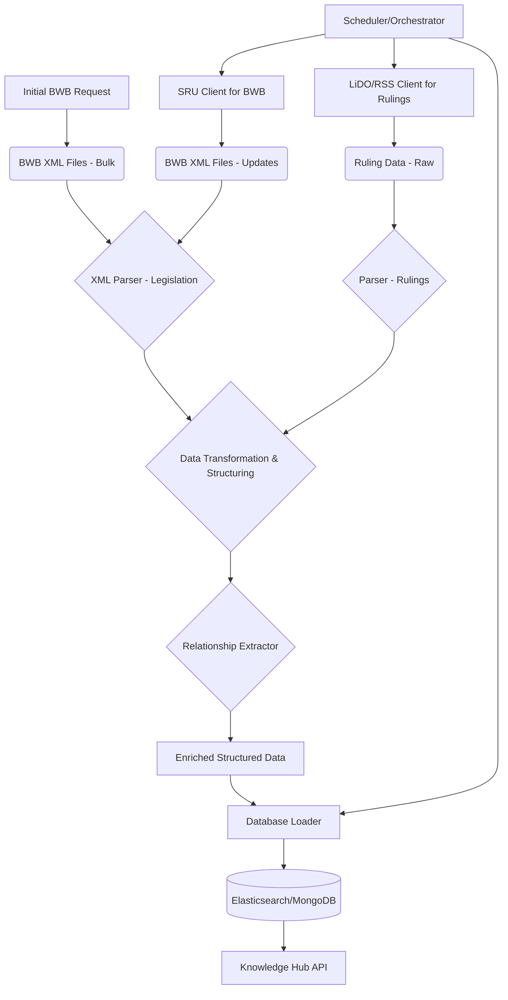

# Dutch Legal Data Ingestion Pipeline - Design

## 1. Overview

This document outlines the design for a data ingestion pipeline to retrieve, process, and store Dutch legal data (legislation and court rulings) for deep integration into the Legal AI Platform's Knowledge Hub. This design is based on the research findings from `wetten.overheid.nl`, `uitspraken.rechtspraak.nl`, `data.overheid.nl` (specifically the "Basis Wetten Bestand" dataset), and the Linked Data Overheid (LiDO) platform.

## 2. Goals

*   Automate the retrieval of Dutch legislation and court rulings.
*   Process and parse the raw data into a structured, usable format.
*   Store the processed data efficiently for search and retrieval by the Knowledge Hub.
*   Ensure the pipeline is scalable, maintainable, and can handle regular updates.

## 3. Data Sources & Retrieval Strategy

### 3.1. Legislation (Basis Wetten Bestand - BWB)

*   **Source**: `data.overheid.nl` provides the "Basis Wetten Bestand" (BWB) dataset.
*   **Initial Retrieval**: 
    *   The dataset description states an initial set (approx. 33,000 regulations, 10GB zipped) can be requested from KOOP (Kennis- en Exploitatiecentrum voor Officiële Overheidspublicaties) via a reaction form.
    *   **Action**: Initiate contact with KOOP to obtain this initial bulk dataset.
*   **Format**: XML.
*   **Updates**: 
    *   Daily updates are available via an SRU (Search/Retrieve via URL) service.
    *   The SRU service allows querying for changes, potentially filtered (e.g., by ministry).
    *   **Action**: Develop an SRU client to periodically (e.g., daily) fetch new and updated XML files for regulations.

### 3.2. Court Rulings (Jurisprudentie)

*   **Primary Source**: `uitspraken.rechtspraak.nl`.
*   **Structured Access**: The Linked Data Overheid (LiDO) platform (`linkeddata.overheid.nl`) appears to be the most promising way to access court rulings in a structured format, as it claims to integrate data from Rechtspraak.nl.
*   **Alternative/Fallback**: Rechtspraak.nl itself mentions RSS feeds, which could be used for updates if direct LiDO access proves difficult for bulk retrieval or if LiDO's update frequency is insufficient.
*   **Format (via LiDO)**: Likely RDF/XML, Turtle, or other linked data formats. If via RSS, it would be XML.
*   **Retrieval Strategy (LiDO)**:
    *   **Action**: Investigate LiDO for SPARQL endpoints, data dumps, or specific APIs for accessing court rulings.
    *   Prioritize methods that allow bulk retrieval for the initial load and incremental updates.
*   **Retrieval Strategy (RSS - Fallback)**:
    *   **Action**: If LiDO is not viable for comprehensive access, develop an RSS feed poller for `uitspraken.rechtspraak.nl` to capture new rulings. This might be less ideal for historical data.

## 4. Data Processing and Parsing

### 4.1. Legislation (BWB - XML)

*   **Parser**: Implement a robust XML parser (e.g., using Python libraries like `lxml` or `xml.etree.ElementTree`).
*   **Key Information to Extract**: 
    *   Document identifier (e.g., BWB-ID).
    *   Official title (`officieleTitel`).
    *   Citation title (`citeertitel`).
    *   Full text content of articles, sections, paragraphs.
    *   Effective dates, enactment dates, repeal dates.
    *   Relationships (e.g., amendments, consolidations, repeals of other laws).
    *   Metadata (e.g., type of regulation, responsible ministry).
*   **Transformation**: Convert extracted data into a standardized JSON or internal object model.
*   **Handling Versions**: Legal documents have multiple versions (toestanden). The pipeline must correctly process and store these different states and their validity periods.

### 4.2. Court Rulings (Jurisprudentie - Format TBD from LiDO/RSS)

*   **Parser**: Dependent on the format obtained from LiDO (likely RDF/XML, Turtle) or RSS (XML).
    *   For RDF/Linked Data: Use libraries like `rdflib` (Python).
    *   For XML (RSS): Similar to legislation XML parsing.
*   **Key Information to Extract**: 
    *   ECLI (European Case Law Identifier) - crucial unique ID.
    *   Court name, date of ruling, date of publication.
    *   Case number(s).
    *   Parties involved (anonymized/pseudonymized as per source).
    *   Summary (if available).
    *   Full text of the ruling.
    *   Keywords or legal topics.
    *   Cited legislation and other court rulings (important for linking).
*   **Transformation**: Convert to a standardized JSON or internal object model, consistent with legislation data where applicable.

### 4.3. Common Processing Steps

*   **Text Cleaning**: Remove boilerplate, normalize whitespace, handle special characters.
*   **Structuring Content**: Break down large texts into manageable sections (articles, paragraphs) for easier search and display.
*   **Link Extraction**: Identify and extract references to other legal documents (both legislation and rulings) within the text to build a knowledge graph.
*   **Language**: Confirm if all documents are in Dutch or if multilingual support is needed for processing.

## 5. Data Storage

*   **Database Choice**: A document-oriented NoSQL database (e.g., Elasticsearch, MongoDB) is highly recommended due to:
    *   **Flexible Schema**: Accommodates variations in document structure.
    *   **Full-Text Search**: Essential for the Knowledge Hub. Elasticsearch is particularly strong here.
    *   **Scalability**: Can handle large volumes of text data.
*   **Data Model/Schema**: 
    *   Define clear schemas for legislation documents and court rulings.
    *   Include fields for all extracted information, metadata, version history, and relationships.
    *   Example Legislation Document Structure:
        ```json
        {
          "id": "bwb-id_version_xyz",
          "type": "legislation",
          "bwb_id": "BWBR0001903",
          "title_official": "Grondwet voor het Koninkrijk der Nederlanden",
          "title_cite": "Grondwet",
          "effective_date": "2023-01-01",
          "publication_date": "...",
          "text_content": "...", // Full text or structured sections
          "articles": [{"number": "1", "text": "..."}],
          "relationships": {"amends": ["bwb-id_abc"], "cited_in_ruling": ["ecli_123"]},
          "source_url": "..."
        }
        ```
    *   Example Court Ruling Document Structure:
        ```json
        {
          "id": "ecli_xyz",
          "type": "ruling",
          "ecli": "ECLI:NL:HR:2023:1",
          "court": "Hoge Raad",
          "ruling_date": "2023-05-10",
          "publication_date": "2023-05-11",
          "summary": "...",
          "text_content": "...",
          "keywords": ["contract law", "damages"],
          "cited_legislation": ["bwb-id_def"],
          "cited_rulings": ["ecli_456"],
          "source_url": "..."
        }
        ```
*   **Indexing**: Create appropriate indexes for efficient searching on key fields (ID, ECLI, title, dates, full text, keywords, relationships).

## 6. Pipeline Workflow & Components



*   **Scheduler/Orchestrator** (e.g., Apache Airflow, Celery Beat, cron jobs with scripts): Manages the execution of different pipeline stages, especially for regular updates.
*   **Retrieval Modules**: Separate modules/scripts for fetching BWB initial set, BWB updates (SRU), and court rulings (LiDO/RSS).
*   **Parsing Modules**: Dedicated parsers for XML (legislation) and the format of court rulings.
*   **Transformation Module**: Standardizes data, cleans text, structures content.
*   **Relationship Extraction Module**: Uses NLP/pattern matching to find links between documents.
*   **Database Loader Module**: Inserts/updates processed data into the chosen database, handling duplicates and versioning.
*   **Logging & Monitoring**: Implement comprehensive logging for each stage and monitoring for pipeline health and data quality.

## 7. Scalability and Maintenance

*   **Modular Design**: Each component of the pipeline should be modular for easier maintenance and updates.
*   **Error Handling**: Robust error handling and retry mechanisms for network issues or parsing errors.
*   **Configuration Management**: Externalize configurations (API keys, URLs, database credentials).
*   **Resource Management**: Consider resource requirements for parsing large XML files and for the database.

## 8. Next Steps

*   Confirm access method for BWB initial bulk download.
*   Finalize investigation into LiDO for court rulings (SPARQL, API, dumps).
*   Select specific parsing libraries and database technology.
*   Begin developing prototype modules for retrieval and parsing of one data source (e.g., BWB updates via SRU).

